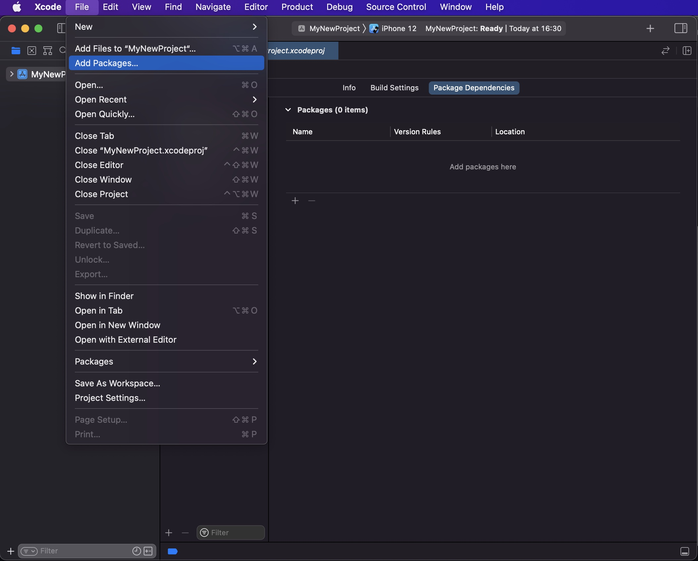
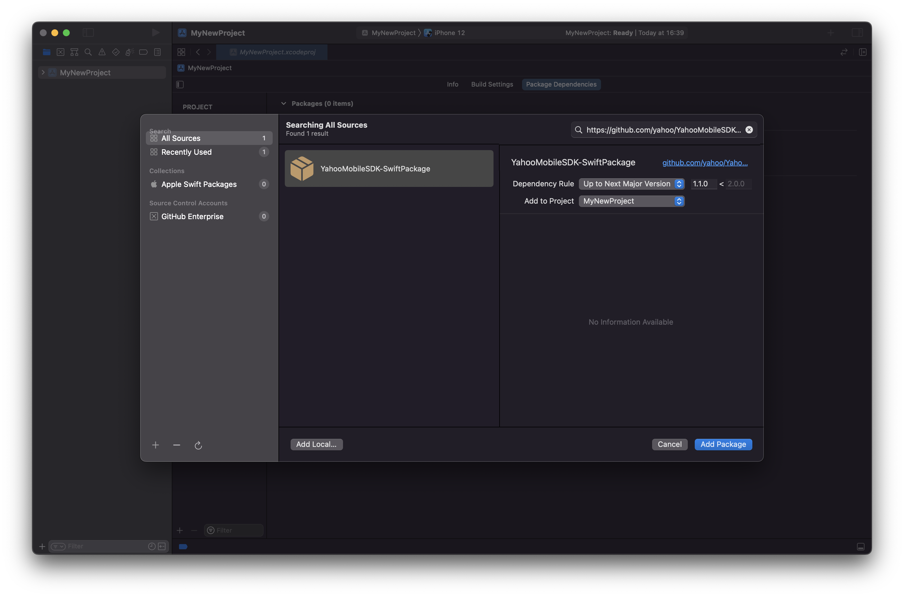
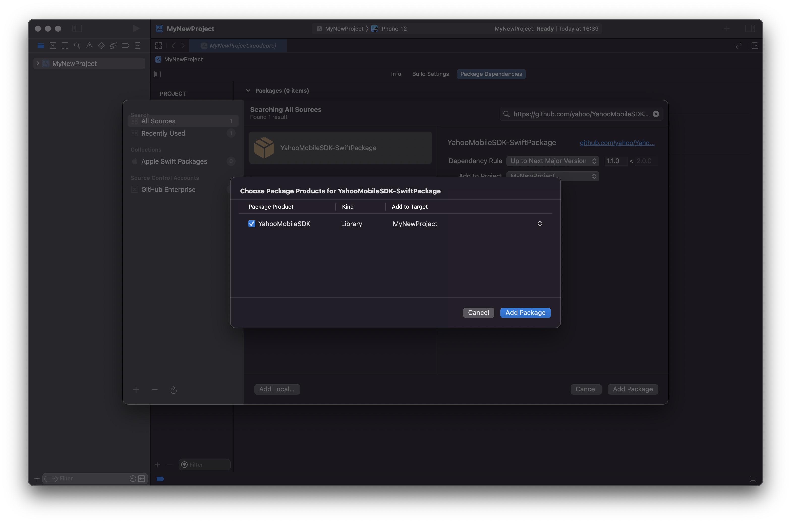
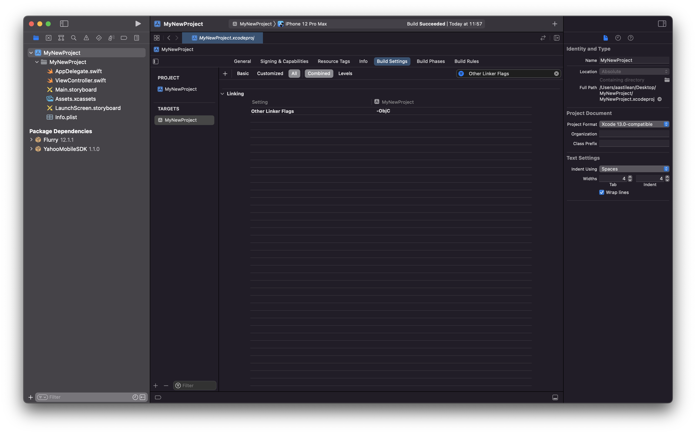

# Yahoo Mobile SDK - Swift Package

The [Swift Package Manager](https://www.swift.org/package-manager/) repository for the [Yahoo Mobile SDK](https://sdk.yahooinc.com/).

## Table of contents
- [Introduction](#introduction)
- [Installation](#installation)
    - [Installing from Xcode](#installing-from-xcode)
    - [Add to a `Package.swift` manifest](#add-to-a-packageswift-manifest)

## Introduction

Starting with the 1.1.0 release, [Yahoo Mobile SDK](https://sdk.yahooinc.com/) officially supports installation via [Swift Package Manager](https://www.swift.org/package-manager/).

## Requirements
- Requires Xcode 12 or above.
- Requires iOS 10 or above.

## Installation

> If you've previously used CocoaPods only for Yahoo Mobile SDK, you can remove them from the project with `pod deintegrate`.

### Installing from Xcode

Add a package by selecting `File` → `Add Packages…` in Xcode’s menu bar.



---

Search for Yahoo Mobile SDK using the repo's URL:
```console
https://github.com/yahoo/YahooMobileSDK-SwiftPackage
```

Next, set the **Dependency Rule** to be `Up to Next Major Version` and specify `1.1.0` as the lower bound.

Then, select **Add Package**.



---

Choose the `YahooMobileSDK` product to install it in your app and click **Add Package**.



---

Add the `-ObjC` option to `Other Linker Flags` in the `Build Settings` tab.


---
### Add to a `Package.swift` manifest

To integrate via a `Package.swift` manifest instead of Xcode, you can add Yahoo Mobile SDK to the dependencies array of your package:

```swift
dependencies: [
    .package(url: "https://github.com/yahoo/YahooMobileSDK-SwiftPackage", from: "1.1.0")
],
```

Then, in any target that depends on a Yahoo Mobile SDK product, add it to the `dependencies` array of that target:

```swift
.target(
    name: "MyNewPackage",
    dependencies: [
        .product(name: "YahooMobileSDK",
                package: "YahooMobileSDK-SwiftPackage")
    ]),
```

Then, add `import YahooAds` to the top of your sourcefile.
